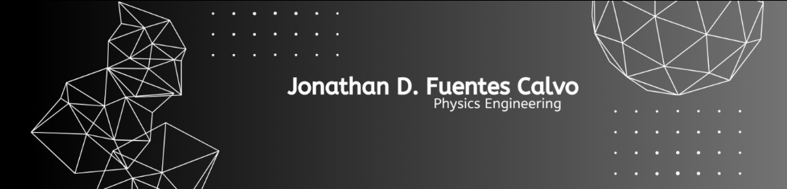

  

Physics and Telecommunications Engineering student from Costa Rica with a strong interest in the intersection of engineering, programming, and applied physics.
Experienced in data analysis, experimental systems, sensors and embedded systems, with motivated to contribute to research and technology projects.
## Areas of interest:
- Hardware Testing & DAQ 
- Signal & Control Systems 
- Embedded Systems & IoT
- Data Science & Data Analytics
- Scientific Computing
- Optics & Fiber-Optic Systems
- Network analysis  

## Tools & Technologies:
- Python (Pandas, NumPy, SciPy, Matplotlib, Seaborn, Plotly (Dash), BeautifulSoup, Scikit-learn)
- C++  (embedded systems, simulation, debugging)
- Machine learning, IA
- SQL (MySQL, SQLite, PostgreSQL)
- Git, GitHub, Linux (basic)
- IP, HTTP, HTTPS, Ethernet
- LabView
- PID controllers
- Laplace and Fourier analysis
- Matlab
- Scilab
- Django, Flask

